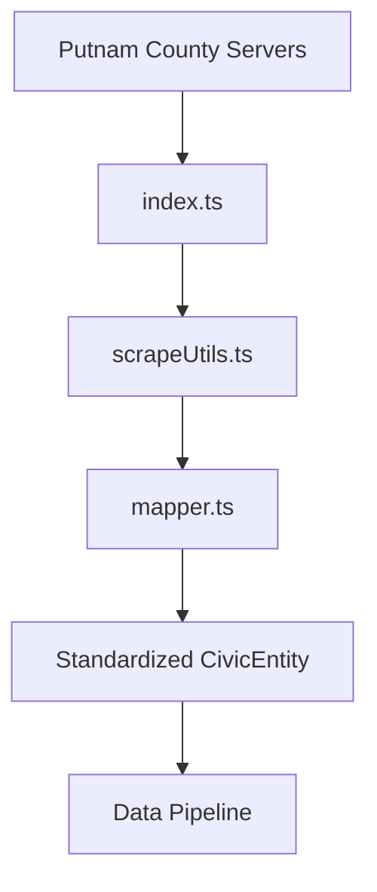

# Putnam County Government Connector (putnam-county-gov)

## Purpose
Direct access to Putnam County government data sources including commission minutes, court dockets, and ordinance databases. Automates extraction of official records for civic transparency initiatives.

## Architecture


## File Structure
```
/lib/connectors/putnam-county-gov/
├── config.json          # Source configuration parameters
├── index.ts             # Connection initialization
├── mapper.ts            # Data transformation layer
└── scraper.ts           # Low-level data retrieval logic
```

## Configuration
```json
{
  "name": "putnam-county-gov",
  "version": "1.0.0",
  "description": "Putnam County Government Data Source Connector",
  "dataSources": {
    "commissionMinutes": "/api/v1/commission",
    "courtDockets": "/api/v1/court",
    "ordinanceDatabase": "/api/v1/ordinances",
    "publicNotices": "/api/v1/notices"
  },
  "extraction": {
    "format": "JSON",
    "authMethod": "API_KEY",
    "rateLimit": 100
  }
}
```

## Critical Components
| Component | Description |
|-----------|-------------|
| `index.ts` | Establishes API connection and session management |
| `mapper.ts` | Converts raw API responses to CivicEntity objects |
| `scraper.ts` | Handles request formatting and error recovery |

## Critical Features
| Feature | Benefit |
|---------|---------|
| **Direct API Access** | Bypasses manual scraping with official API endpoints |
| **Structured Data**: Returns standardized CivicEntity format |
| **Audit Trail**: Logs all extraction sessions with timestamps |
| **Failover Handling**: Uses alternate endpoints when source unstable |
| **Schema Validation**: Ensures output conforms to expected civic schema |

## Integration
Registered in `/lib/pipeline/data-pipeline.ts` for concurrent execution with other civic sources.